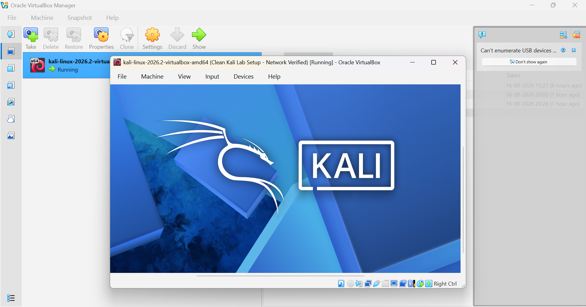
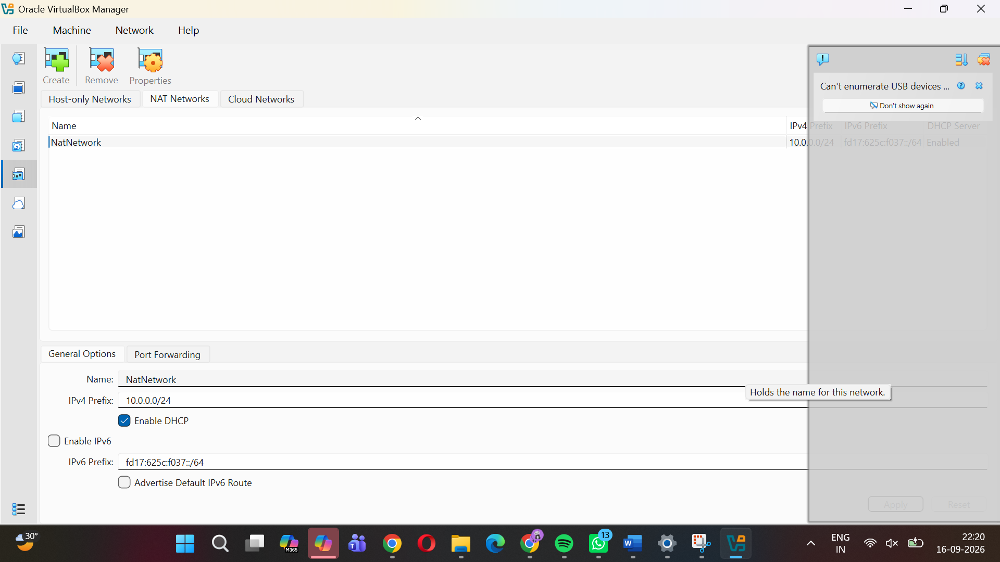
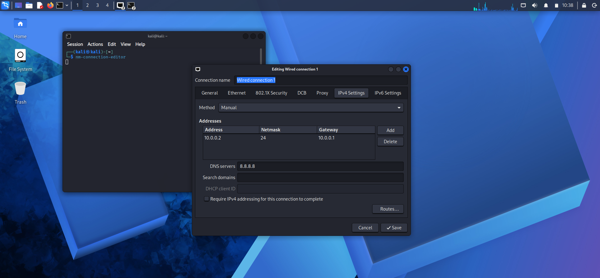
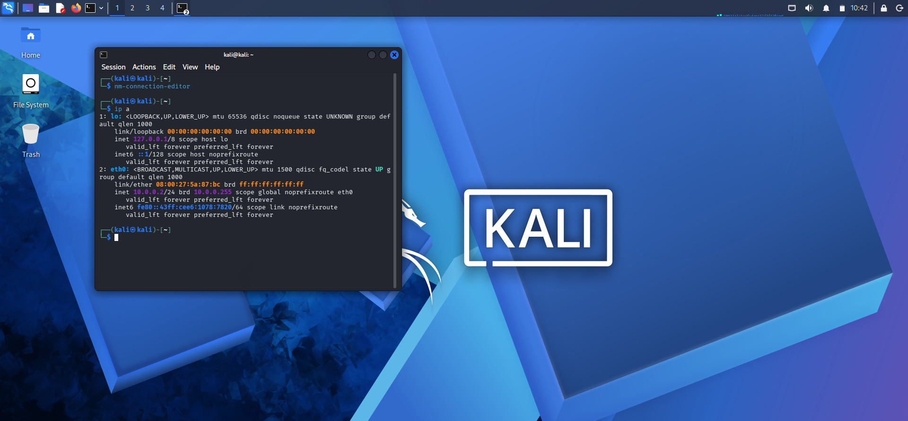
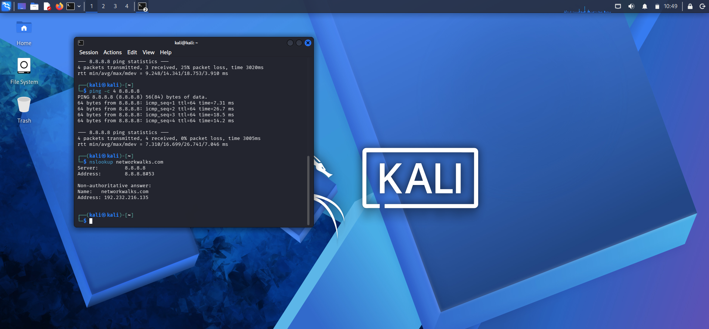
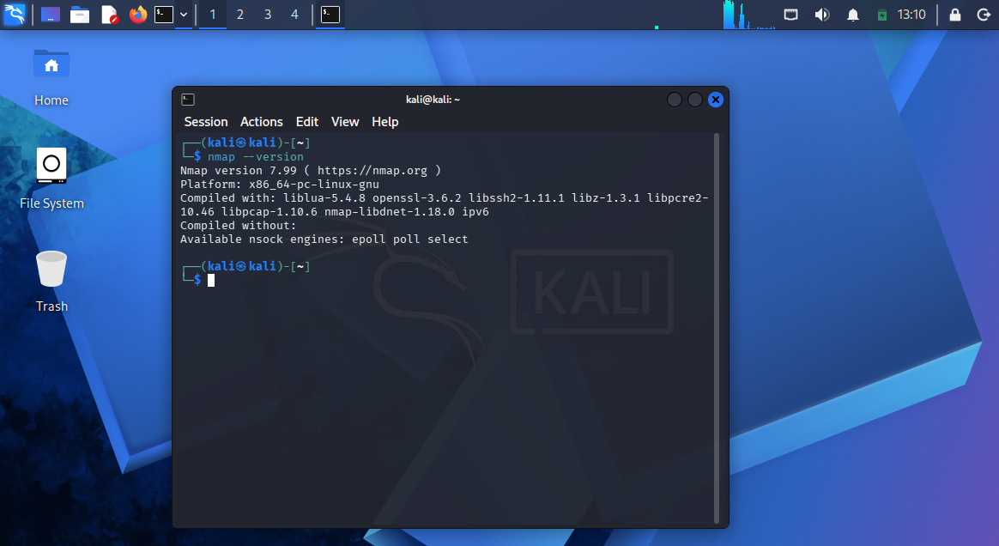
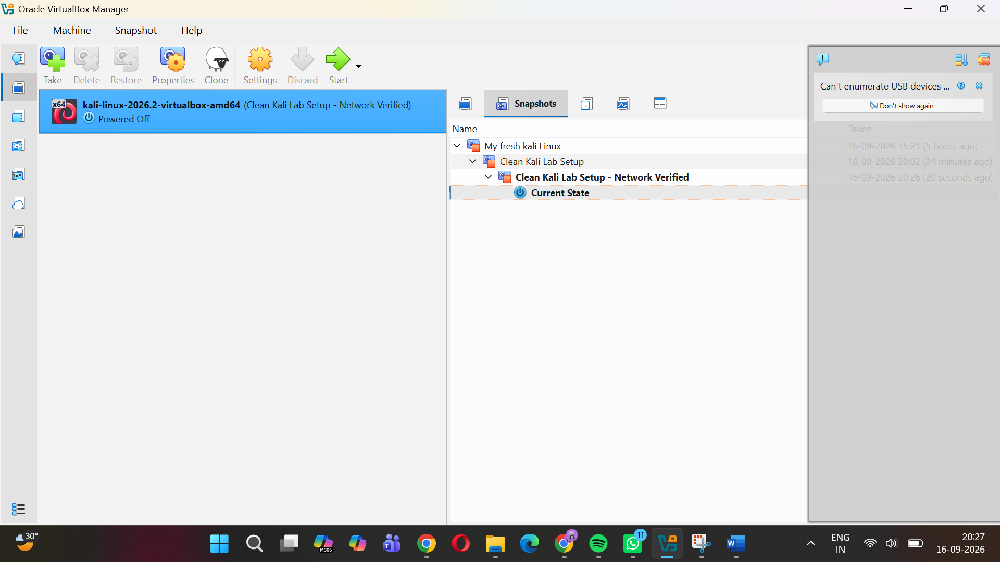

<div align="center">

# 🔐 Cybersecurity Lab Environment Setup

**Week 1 Project — NetworkWalks B083**

**Building a controlled virtual lab for cybersecurity learning and authorized security testing**

</div>

<p align="center">
  
  
  
  
  
</p>

---
## 📌 Project Overview

This project documents my Week 1 cybersecurity laboratory setup for the NetworkWalks program.

The lab was created using **Oracle VirtualBox** and **Kali Linux 2026.2**. The purpose of this setup is to create a controlled virtual environment for cybersecurity learning, networking practice, and authorized security-testing activities.

The Kali Linux virtual machine was configured using a **NAT Network** with a consistent IPv4 address. This environment will serve as the foundation for future practical cybersecurity exercises.

## 🎯 Objectives

The main objectives of this project were to:

- Install and configure Oracle VirtualBox.
- Set up Kali Linux as a virtual machine.
- Configure a NAT Network.
- Configure a static IPv4 address for Kali Linux.
- Configure the gateway and DNS server.
- Verify local gateway connectivity.
- Verify external network connectivity.
- Verify DNS resolution.
- Confirm that Nmap is installed and working.
- Create a clean VirtualBox snapshot after completing the setup.
- Document the configuration, verification, and troubleshooting process.

---
## 🛡️ Purpose of the Lab

The laboratory provides a controlled environment for cybersecurity learning and authorized testing.

It can later be used for activities such as:

- Network reconnaissance
- Port scanning
- Vulnerability-assessment practice
- Packet analysis
- Web-security testing
- Security-tool experimentation

⚠️ **Important:** This laboratory should only be used against systems that I own or have explicit permission to test.

---
# 🏗️ Lab Architecture

The basic environment consists of a Windows 11 host machine running Oracle VirtualBox, with Kali Linux configured as the guest operating system.

```text
┌───────────────────────────────┐
│       Windows 11 Host         │
│      HP Laptop 14s-dr1xxx     │
│                               │
│       Oracle VirtualBox       │
│           7.2.18              │
│               │               │
│               ▼               │
│       ┌───────────────┐       │
│       │ Kali Linux    │       │
│       │    2026.2     │       │
│       │ 10.0.0.2/24   │       │
│       └───────┬───────┘       │
│               │               │
│          NAT Network          │
│         10.0.0.0/24           │
│               │               │
│        Gateway 10.0.0.1       │
└───────────────────────────────┘
```

---

# ⚙️ Lab Configuration

## 💻 Host Machine

| Component | Configuration |
|-----------|---------------|
| Laptop | HP Laptop 14s-dr1xxx |
| Host OS | Windows 11 |
| Processor | Intel(R) Core(TM) i3-1005G1 CPU @ 1.20GHz |
| Host RAM | 8 GB |
| System Type | 64-bit operating system, x64-based processor |
| Graphics | Intel(R) UHD Graphics |
| Storage | 477 GB |

## 🖥️ Virtual Lab

| Component | Configuration |
|-----------|---------------|
| Hypervisor | Oracle VirtualBox |
| VirtualBox Version | 7.2.18 r175117 |
| Security OS | Kali Linux 2026.2 |
| Virtual Network | NAT Network |
| Network Address | 10.0.0.0/24 |
| Kali IP Address | 10.0.0.2/24 |
| Default Gateway | 10.0.0.1 |
| DNS Server | 8.8.8.8 |

---

# 🪜 Lab Setup Procedure

## Step 1. Prepare the Virtualization Environment

Oracle VirtualBox was installed on my Windows 11 host machine and used as the virtualization platform for the Kali Linux laboratory.

### Screenshot



---

## Step 2. Set Up Kali Linux

Kali Linux 2026.2 was configured as the guest operating system inside VirtualBox.

The virtual machine was prepared as the main cybersecurity workstation for the laboratory.

---

## Step 3. Configure the NAT Network

A NAT Network was used to provide networking for the virtual laboratory.

The lab network was configured with the following settings:

| Setting | Value |
| --- | --- |
| Network Type | NAT Network |
| Network Address | 10.0.0.0/24 |
| Gateway | 10.0.0.1 |

The NAT Network allows the Kali Linux virtual machine to communicate with the gateway and access external network resources while keeping the laboratory environment separated from the host network.

### Network Configuration

```text
Network: 10.0.0.0/24
Gateway: 10.0.0.1
```
### Screenshot


---

## Step 4. Configure the Static IPv4 Address

The Kali Linux virtual machine was configured with a static IPv4 address to keep the network configuration consistent during the laboratory exercises.

The IPv4 settings were configured as follows:

| Setting | Value |
| --- | --- |
| IPv4 Method | Manual |
| IP Address | 10.0.0.2 |
| Netmask | 24 |
| Gateway | 10.0.0.1 |
| DNS Server | 8.8.8.8 |

The static IP configuration was applied using the Network Connections settings in Kali Linux.

### Screenshot



## Step 5. Verify the Lab Network

After configuring the network, several commands were used to verify the setup.

### Check the Kali IP Address

```bash
ip a
```

The `eth0` interface showed:

```text
10.0.0.2/24
```

### Screenshot



This confirmed that the configured static IP address was assigned.

### Test Gateway Connectivity

```bash
ping -c 4 10.0.0.1
```

Result:

```text
4 packets transmitted
4 packets received
0% packet loss
```

### Screenshot


This confirmed connectivity between Kali Linux and the configured gateway.

### Test External Connectivity

```bash
ping -c 4 8.8.8.8
```

The first test showed packet loss, so the test was repeated.

The repeated test completed with:

```text
4 packets transmitted
4 packets received
0% packet loss
```

### Screenshot


This confirmed successful external connectivity.

### Test DNS Resolution

```bash
nslookup networkwalks.com
```

The query used:

```text
Server: 8.8.8.8
```

and successfully returned an address for `networkwalks.com`.

### Screenshot



### Verify Nmap

```bash
nmap --version
```

The installed version was:

```text
Nmap version 7.99
```

### Screenshot



This confirmed that Nmap was available and working in the Kali Linux environment.

---
## Step 6. Create a Virtual Machine Snapshot

After completing the Kali Linux configuration and network verification, a snapshot was created in VirtualBox.

The snapshot provides a clean restore point for the cybersecurity laboratory.

### Snapshot Details

| Setting | Value |
| --- | --- |
| Snapshot Name | Clean Kali Lab Setup - Network Verified |
| Status | Kali VM powered off |
| Purpose | Restore point for the verified lab environment |

The snapshot was created after verifying the static IP address, gateway connectivity, internet connectivity, DNS resolution, and Nmap installation.

This allows the virtual machine to be restored to a known working state if any configuration changes cause problems during future laboratory exercises.

### Screenshot



---

## Lab Verification Summary

The following checks were completed successfully:

| Verification | Result |
| --- | --- |
| Kali IP Address | 10.0.0.2/24 |
| Gateway Connectivity | Successful |
| Internet Connectivity | Successful |
| DNS Resolution | Successful |
| Nmap Installation | Nmap 7.99 |
| Virtual Machine Snapshot | Created |

The laboratory environment was successfully configured and verified for cybersecurity training activities.

---

## Problems Encountered & Solutions

During the lab setup, a few issues were encountered and resolved.

### 1. Difficulty Entering Commands in the Kali Terminal

While working in the Kali terminal, some commands were initially entered incorrectly due to difficulty with terminal input.

**Solution:**  
The terminal input was checked and the commands were entered again carefully until they executed correctly.

### 2. Network Connections Menu Was Not Visible

The expected network configuration option was not directly visible from the network menu.

**Solution:**  
The following command was used to open the Network Connections configuration window:

```bash
nm-connection-editor
```

The IPv4 settings were then configured manually.

### 3. Initial Packet Loss During Internet Connectivity Test

The first external connectivity test using:

```bash
ping -c 4 8.8.8.8
```

showed 25% packet loss, with 3 out of 4 packets received.

**Solution:**  
The ping test was repeated. The second test completed successfully with 0% packet loss.

This confirmed that the network connection was working correctly.

---

## What I Learned

Through this lab setup, I learned how to:

- Install and configure Kali Linux in VirtualBox.
- Configure a NAT Network for a virtual cybersecurity laboratory.
- Assign a static IPv4 address to a Kali Linux virtual machine.
- Configure the gateway and DNS settings.
- Verify network connectivity using ping.
- Verify DNS resolution using nslookup.
- Check Nmap installation and version.
- Create a VirtualBox snapshot for restoring the lab environment.
- Troubleshoot basic networking and terminal configuration issues.

This lab provided practical experience in preparing a controlled environment for future cybersecurity exercises.

---

## 🔐 Security & Ethical Use

This cybersecurity laboratory was created only for educational purposes and authorized security testing.

All activities were performed within the controlled virtual lab environment. Any scanning, testing, or security-related activity should only be conducted on systems and networks where proper permission has been provided.

The lab environment helps provide a safe and isolated setup for learning cybersecurity concepts without affecting unauthorized systems.

---

## 🛠️ Tools & Resources

### Tools Used

- Oracle VirtualBox
- Kali Linux 2026.2
- Nmap 7.99
- Windows 11
- NetworkManager
- `ping`
- `nslookup`

### Resources

- **7-Zip:** [https://7-zip.org/download.html](https://7-zip.org/download.html)
- **VirtualBox:** [https://virtualbox.org/wiki/Downloads](https://virtualbox.org/wiki/Downloads)
- **Kali Linux:** [https://kali.org/get-kali](https://kali.org/get-kali)


---

## 👤 Author

**Shakthi S P**

Cybersecurity Trainee — NetworkWalks  
Batch: **B083**
LinkedIn: [Shakthi S P](https://www.linkedin.com/in/shakthi-sp-7309b6204/)

---

## 📌 Project Information

**Program Name:** Cybersecurity at NetworkWalks | **Week:** 01 | **Project:** Cybersecurity & Pentesting Lab Setup | **Repository:** GitHub

---

⭐ **Lab setup completed and verified successfully.**
